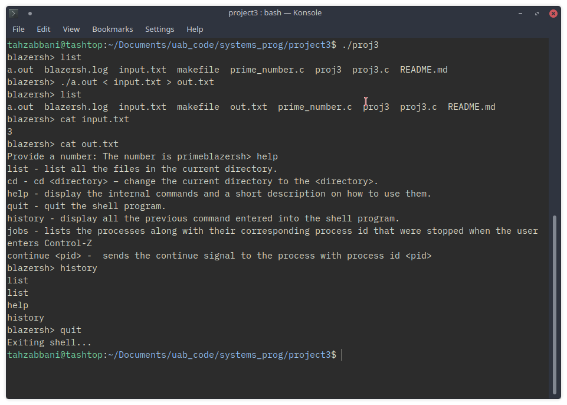
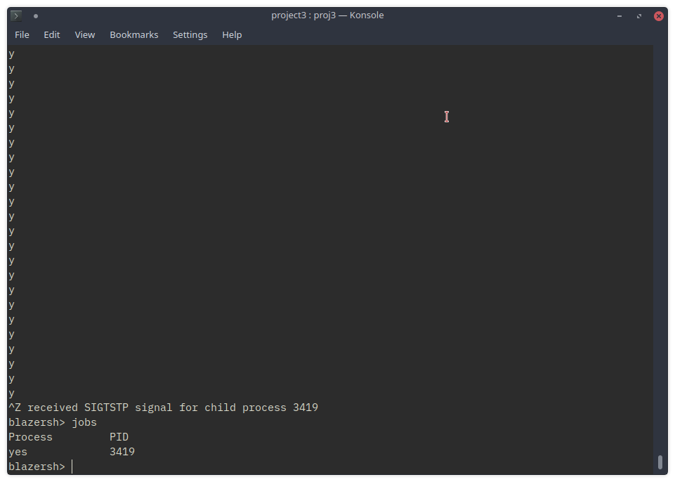

# Project 3 - Extending the Shell

## Problem Description 
Add the following additional functionality to the simple shell program from Project-2:
 1. The simple shell program should intercept Control-C and Control-Z characters and perform the appropriate action on the child process instead of the parent process (i.e., interrupt the child process instead of interrupting the parent process when Control-C is entered and stop the child process instead of stopping the parent process when Control-Z is entered). You should print a message saying the child process has been interrupted or stopped.
2. The shell program should support I/O redirection for both standard input and standard output. For example: ./myprog arg1 arg2 < inputfile > outputfile.  The program myprog with command-line arguments arg1 and arg2, uses inputfile file for standard input file stream and sends standard output file stream to the file outputfile. If the file outputfile does not exist, a new file should be created and if the file outputfile exists, it should be over-written. You can assume that white space will serve as the delimiter for the I/O redirection symbols < and >.

Implement the following internal commands:

1. jobs - lists the processes along with their corresponding process id that were stopped when the user enters Control-Z. Whenever the user enters the Control-Z character, the simple shell program must keep track of processes that are stopped and the jobs command should list such processes.
2. continue < pid > - sends thecontinue signal to the process with process id < pid >. You can obtain the < pid > to send the continue signal using the jobs commands.

## Author

Tahseen Robbani

## Acknowledgement 

Some information about ```mmap()``` taken from Stack Overflow, specifically this link:
https://stackoverflow.com/questions/26259421/use-mmap-in-c-to-write-into-memory

## Getting Started

- This program uses the ```readline()``` function so that needs to be on your system.
- Run this program by typing ```make``` in the command line then executing by typing ```./proj3```.
- Type "help" to see a list of commands that you can use.
- DISCLAIMER:   
  - After continuing a stopped process, the prompt ```blazersh>``` does not appear for one iteration, but it still works.

## Running the Test

Run the test cases by starting the shell typing any of the commands that are provided. After going through a few of the commands, verify that it is printed to the history command and to the log file. Start a few processes and make sure they get stopped with ^C and ^Z and if it is ^Z, see that it is added to the jobs list.

## Screenshots

- general commands


- jobs command, typing ```continue < pid >``` will continue the yes process


## Contact Information

Email: tar0025@uab.edu


